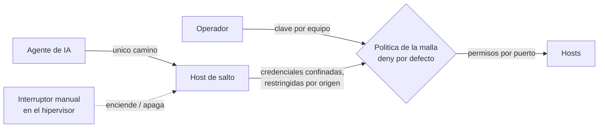
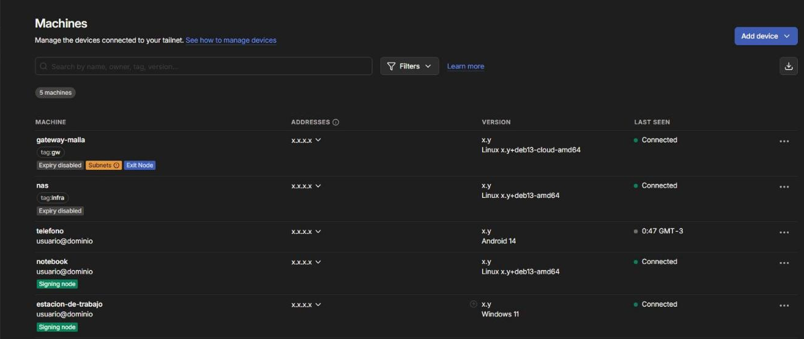
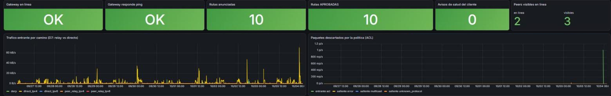

# Zero Trust Remote Access

> Acceso remoto sin un solo puerto abierto, y agentes de IA que operan con minimo privilegio.

Este repositorio documenta, de forma sanitizada, el modelo de acceso remoto
de una infraestructura productiva personal (homelab): una malla superpuesta con identidad por nodo y sin
puertos entrantes, y un diseno de minimo privilegio especifico para agentes
de IA, con un unico camino de entrada y un interruptor manual.

Es parte de un portfolio tecnico. **No es un laboratorio de prueba: es
infraestructura productiva.** No tiene la escala de una empresa, pero tiene
todas sus piezas -virtualizacion, red segmentada, DNS, almacenamiento, backups
con copia externa, monitoreo, SIEM, acceso remoto y aplicaciones en uso- y
funciona 24/7 sobre un hipervisor de tipo 1 (Proxmox VE) en un servidor dedicado. Cuando
algo falla, el impacto es real.

La documentacion operativa es privada. Esto es su version transformada
-decisiones, patrones y aprendizajes-, sin datos que permitan identificar o
reproducir el entorno.

Lo que busca demostrar: capacidad de disenar acceso remoto sin exponer
puertos al borde, y un enfoque de minimo privilegio aplicado a asistentes de
IA que participan de tareas de operacion, donde la restriccion vive en la
infraestructura y no en la buena conducta del agente.

## Escala chica, exigencia de produccion

| Pieza | Con que | Si falla |
|---|---|---|
| Virtualizacion | Proxmox VE, hipervisor de tipo 1; una maquina por funcion | cae todo lo demas |
| DNS interno | Pi-hole, resolucion para todos los equipos y servicios | todo parece caido aunque este sano |
| Red y acceso remoto | zonas por funcion; Tailscale sin puertos abiertos, politica por puerto | se pierde el aislamiento o el acceso desde afuera |
| Almacenamiento y backups | OpenMediaVault, backups nocturnos, copia cifrada externa, pruebas de restauracion | se pierde la capacidad de recuperar |
| Monitoreo y seguridad | Prometheus, Grafana, Wazuh y alertas al telefono | los incidentes pasan sin que nadie se entere |
| Aplicaciones propias | Docker detras de Nginx Proxy Manager; una envia correo real | se frena trabajo real |
| Codigo | Forgejo privado con integracion continua | no hay donde versionar ni desde donde desplegar |

Lo mismo que en una empresa, en chico: cambios con plan y rollback, evidencia,
alertas que avisan solas y controles que se prueban haciendolos fallar.

## En 30 segundos

| Indicador | Resultado |
|---|---|
| Puertos entrantes abiertos | **0**: cada nodo sale hacia el plano de control |
| Caminos de acceso para agentes de IA | **1**, con interruptor manual fuera de su alcance |
| Pruebas negativas del privilegio del agente | **3 de 3 denegadas** (lector generico, interprete, material de otro agente) |
| Permiso total que tenia el agente y realmente uso | **ninguno**: la lista final salio de medir el uso real |
| Intentos no autorizados frenados por la politica en un solo incidente | **13.017** ([detalle](https://github.com/Nicolasperaltait/network-segmentation-playbook/blob/main/docs/02-resultados-medidos.md)) |

## En vivo

_Capturas reales del entorno, con nombres, direcciones, usuarios y versiones reemplazados por su funcion._

La malla: nodos firmantes (tailnet lock), subnet router y exit node.

Monitoreo propio de la malla: gateway, rutas aprobadas y paquetes descartados por la politica.

## Problema, decision, resultado

| Problema | Por que importaba | Que se hizo | Resultado |
|---|---|---|---|
| El acceso remoto exigia abrir un puerto en el borde | todo el resto del diseno evita exponer el borde | malla con identidad por nodo y politica por puerto | 0 puertos entrantes; 13.017 intentos no permitidos frenados |
| Un agente de IA con claves en la estacion del operador era, en la practica, el operador | no se podia cortar ni auditar por separado | un unico host de salto con interruptor manual y credenciales confinadas | el agente **no puede**, en vez de **no debe** |
| Dentro del host de salto el agente tenia privilegio total sin haberlo pedido | una regla que se cumple por voluntad no es un control | lista de permisos derivada del uso real medido | 3 de 3 pruebas negativas denegadas |

El detalle de cada uno, con lo que salio mal en el camino, esta en los casos de estudio.

## Indice

- [Ficha rapida para quien evalua](contexto.md)
- [Seguridad y modelo de accesos](docs/01-seguridad-y-accesos.md)
- [Caso de estudio: acceso de agentes de IA con minimo privilegio](docs/casos-de-estudio/01-acceso-de-agentes-de-ia-y-minimo-privilegio.md)

## Parte de una serie

Este repo es una pieza de **[Homelab Prod](https://github.com/Nicolasperaltait/homelab)**:
la vista completa de una infraestructura productiva, chica en escala y completa
en piezas, encendida 24/7. Cada repo de la serie se lee solo; la portada los une.

- [Zero Trust Remote Access](https://github.com/Nicolasperaltait/zero-trust-remote-access) (este repo)
- [Network Segmentation Playbook](https://github.com/Nicolasperaltait/network-segmentation-playbook)
- [Alerts That Matter](https://github.com/Nicolasperaltait/alerts-that-matter)
- [Backups That Don't Lie](https://github.com/Nicolasperaltait/backups-that-dont-lie)
- [Hypervisor as Control Plane](https://github.com/Nicolasperaltait/hypervisor-as-control-plane)

## Licencia

Ver [LICENSE.md](LICENSE.md).
