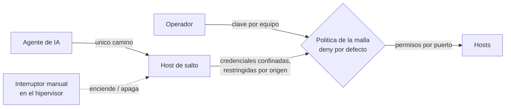

# Zero Trust Remote Access

> Acceso remoto sin un solo puerto abierto, y agentes de IA que operan con minimo privilegio.

Este repositorio documenta, de forma sanitizada, el modelo de acceso remoto
de una infraestructura productiva personal (homelab): una malla superpuesta con identidad por nodo y sin
puertos entrantes, y un diseno de minimo privilegio especifico para agentes
de IA, con un unico camino de entrada y un interruptor manual.

Es parte de un portfolio tecnico. **No es un laboratorio de prueba**: es una
**infraestructura productiva personal**. Un hipervisor de tipo 1 sobre un
servidor dedicado, encendido 24/7, del que dependen todos los dias la red de la
casa, los backups, la seguridad y aplicaciones en uso real. Si se apaga, se nota.

La documentacion operativa es privada. Esto es su version transformada
-decisiones, patrones y aprendizajes-, sin datos que permitan identificar o
reproducir el entorno.

Lo que busca demostrar: capacidad de disenar acceso remoto sin exponer
puertos al borde, y un enfoque de minimo privilegio aplicado a asistentes de
IA que participan de tareas de operacion, donde la restriccion vive en la
infraestructura y no en la buena conducta del agente.

## Por que es infraestructura productiva

| Servicio que corre 24/7 | Que pasa si se cae |
|---|---|
| DNS de toda la red de la casa | ningun equipo resuelve nombres: para quien la usa, "se corto internet" |
| Backups nocturnos y copia cifrada fuera del sitio | se pierde la proteccion de los datos y nadie lo nota hasta necesitarla |
| SIEM, metricas y alertas al telefono | los incidentes pasan sin que nadie se entere |
| Acceso remoto por malla | no hay forma de operar desde fuera de casa |
| NAS y espejo de la estacion de trabajo | se corta la sincronizacion de los archivos de trabajo |
| Aplicaciones propias en uso diario | se frena el uso real, incluido el envio de correo |
| Remoto de codigo propio | no hay donde versionar ni desde donde desplegar |

Por eso cada cambio se trata como en produccion: plan, rollback, evidencia y
verificacion de que lo que tiene que fallar, falla.

## En 30 segundos

| Indicador | Resultado |
|---|---|
| Puertos entrantes abiertos | **0**: cada nodo sale hacia el plano de control |
| Caminos de acceso para agentes de IA | **1**, con interruptor manual fuera de su alcance |
| Pruebas negativas del privilegio del agente | **3 de 3 denegadas** (lector generico, interprete, material de otro agente) |
| Permiso total que tenia el agente y realmente uso | **ninguno**: la lista final salio de medir el uso real |
| Intentos no autorizados frenados por la politica en un solo incidente | **13.017** ([detalle](https://github.com/Nicolasperaltait/network-segmentation-playbook/blob/main/docs/02-resultados-medidos.md)) |

## Indice

- [Ficha rapida para quien evalua](contexto.md)
- [Seguridad y modelo de accesos](docs/01-seguridad-y-accesos.md)
- [Caso de estudio: acceso de agentes de IA con minimo privilegio](docs/casos-de-estudio/01-acceso-de-agentes-de-ia-y-minimo-privilegio.md)

## Parte de una serie

Este repo es una pieza de un proyecto mas grande: una **infraestructura
productiva personal** (homelab), encendida 24/7 y documentada en cinco repos
independientes. Cada uno se lee solo; juntos muestran el entorno completo.

- [Zero Trust Remote Access](https://github.com/Nicolasperaltait/zero-trust-remote-access) (este repo)
- [Backups That Don't Lie](https://github.com/Nicolasperaltait/backups-that-dont-lie)
- [Alerts That Matter](https://github.com/Nicolasperaltait/alerts-that-matter)
- [Network Segmentation Playbook](https://github.com/Nicolasperaltait/network-segmentation-playbook)
- [Hypervisor as Control Plane](https://github.com/Nicolasperaltait/hypervisor-as-control-plane)

## Licencia

Ver [LICENSE.md](LICENSE.md).
